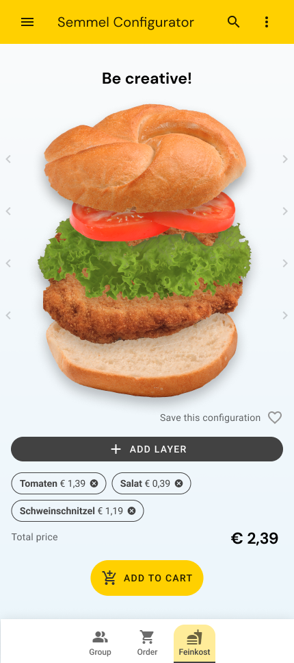

# Documentation

\
_The Schmankerl Configurator in the running application_

## Concept

The hackathon project addresses the challenge of improving the efficiency and customer experience of fresh snack counters at BILLA stores. The key issues identified include long customer lines during rush hours, food waste due to inaccurate predictions of ingredient needs, and employee stress from last-minute snack preparation.

To tackle these issues, the project focuses on two main solutions:

**Group Ordering**\
Encouraging group orders ensures **better resource planning and a streamlined process** for taking and preparing orders. Customers receive push notifications to remind them to join their group orders early, reducing wait times and enhancing the overall lunch experience. The business can leverage psychological effects of **group dynamics to increase turnover**. This is encouraged by a user-friendly UI for group orders and the incentive of a free surprise for one of the group members. We are confident that this solution has high PR-value and has word-of-mouth potential.

**SpecialsAI**\
This system leverages customer preferences, sales data, and leftover ingredients to create special offers for the next day. By **reusing ingredients efficiently**, it **minimizes food waste** and supports sustainable business practices. The AI-chosen recipes are then added to the BILLA app as the next day’s special, ensuring fresh and desirable options for customers.

The project envisions a seamless experience for both customers and employees. Customers can place orders in advance via the app or in-store terminals, reducing wait times. Employees benefit from better preparation, less stress, and reduced food waste, ultimately leading to a more efficient and enjoyable operation.

\
_The team started to work on the concept by drafting the user journey during a typical working day. Additionally we analyzed the steps taken by employees and moments, when useful data is generated._

## Target Architecture

Our aim is to seamlessly bring the Schmankerl-Assistant into BILLA's Web- and AppSolution applications. Technologically, this means that the frontend will be powered by Nuxt (Vue), or the respective mobile OS technology and the backend is a Spring Boot application.

The backend will connect to existing REWE-internal services such as the Ripoint for customer data and the ECOM-platform for capacity evaluations and the cart/order management. This will allow to leverage well-tested and production-proven software with great integration into the REWE infrastructure.

As an additional enhancement, which will be further layed out in the section "Outlook for the future", we suggest to integrate the Schmankerl-Assistant into the tools for the Wareneinkauf and the store redistribution systems.

## Outlook for the future

**Growing usage**\
The usage of our Schmankerl-Assistant will generate even more valuable data which will allow the business to perform more accurate predictions. Using these predictions will help with restocking the right ingredients and the right quantities, thus, reducing the loss due to the write-off of left overs.

**Enhancements for SpecialsAI**\
In order to optimize the SpecialsAI, we would suggest to enhance it by including the recipes' popularity, price and the expiration date of the available ingredients.

**Quick Commerce**\
Could be combined with the Schmankerl-Assistant. After submitting the group order, a Foodora driver could pick it up and delivery it directly to the customers.

**User-generated recipes and gamification**\
When it comes to additional features, we are thinking of sharable user-generated recipes. These are a great source for data collection, personalization, customer loyalty and growing the recipe database. Visualizing them in leaderboards introduces a gamification effect.
